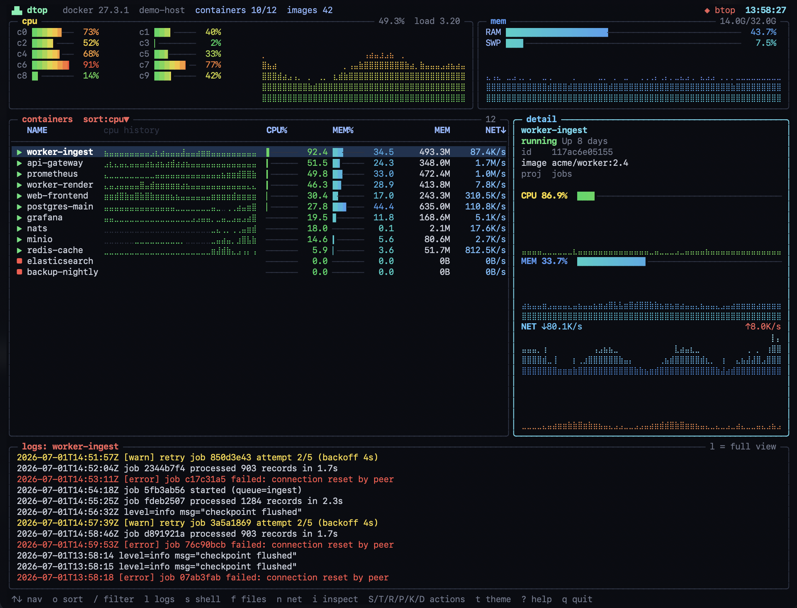

# dtop

A [btop](https://github.com/aristocratos/btop)-styled terminal UI to **monitor and manage Docker containers** — 24-bit truecolor, braille graphs, rounded boxes, live logs, and swappable themes. One dependency-free Python file.

[](https://github.com/tpenzkofer/dtop/actions/workflows/ci.yml)
[](LICENSE)


<details>
<summary>Static screenshot</summary>



</details>

> Shown in `--demo` mode. Try it yourself with `dtop --demo` (no Docker needed), or `dtop --selftest` to render one frame to stdout. The GIF is scripted with [VHS](https://github.com/charmbracelet/vhs) — see [`docs/demo.tape`](docs/demo.tape).

## Features

- **btop aesthetic** — 24-bit truecolor, braille line graphs, gradient meter bars, rounded boxes, and a fully painted canvas.
- **Host overview** — per-core CPU bars + total CPU graph, load average, RAM/SWAP meters with history.
- **Container table** — name, live CPU%/MEM% gradient meters, memory, network rate, PIDs, and a per-row braille CPU-history sparkline. Sortable and filterable.
- **Detail panel** — CPU / memory / network (download + upload) braille graphs for the selected container, plus image, ports, project and status.
- **Live logs panel** across the bottom, following the selected container (error/warn lines highlighted). Press `l` for a large, scrollable, wrap-toggleable full log view.
- **Manage containers** — start, stop, restart, pause/unpause, kill, and remove (destructive actions ask to confirm).
- **Explore** — `s` shell into a container (`exec` bash/sh), `f` browse its filesystem, `n` view its network setup with an ASCII topology **and a copy-paste Mermaid diagram**.
- **Themes** — 6 built-in (`btop`, `gruvbox`, `dracula`, `nord`, `tokyo-night`, `matrix`); cycle live with `t` (persisted), or `--theme NAME`.
- **Robust rendering** — diff-based redraws (low bandwidth over SSH), wide-character/emoji aware, tab-safe, and everything clipped to its panel.
- **Zero dependencies** — pure Python standard library, single file.

## Requirements

- Linux host with the `docker` CLI available and permission to use it (member of the `docker` group, or run via sudo). Host CPU/memory stats are read from `/proc`.
- Python **3.8+**.
- A terminal with 24-bit color and a font that includes braille glyphs (most modern terminals qualify).

## Install

### Run the single file (no install)

```bash
curl -fsSL https://raw.githubusercontent.com/tpenzkofer/dtop/main/dtop.py -o dtop
chmod +x dtop
./dtop
```

### With pipx (recommended)

```bash
pipx install git+https://github.com/tpenzkofer/dtop.git
dtop
```

### With pip

```bash
pip install git+https://github.com/tpenzkofer/dtop.git
```

### System-wide

```bash
sudo install -m755 dtop.py /usr/local/bin/dtop
```

## Usage

```
dtop [options]

  --demo           run with curated fake data (no Docker needed)
  --theme NAME     start with a theme (btop/gruvbox/dracula/nord/tokyo-night/matrix)
  --list-themes    list available themes and exit
  --selftest       render one frame to stdout and exit (no TTY needed)
  --version        print version
  -h, --help       show help
```

### Try it without Docker

```bash
dtop --demo               # full interactive UI with lively fake data
dtop --demo --theme dracula
```

`--demo` populates a realistic set of containers with animated graphs, colorful
logs, and working detail/network/filesystem views — handy for trying it out or
grabbing a screenshot. Combine with `--selftest` to print a single frame.

### Keys

| Key | Action |
| --- | --- |
| `↑`/`k` `↓`/`j` | move selection |
| `PgUp`/`PgDn`, `Home`/`g`, `End`/`G` | jump |
| `o` / `O` | cycle sort field / reverse order |
| `a` | toggle all / running-only |
| `/` | filter by name / image / project |
| `l` / `Enter` | full log view (`w` wrap, `←`/`→` scroll, `r` refresh) |
| `i` | inspect (`docker inspect` JSON) |
| `s` | shell into container (`exec` bash/sh) |
| `f` | browse container filesystem |
| `n` | network setup + Mermaid diagram |
| `S` `T` `R` `P` `K` `D` | start · stop · restart · pause/unpause · kill · remove |
| `t` | cycle color theme (saved to config) |
| `?` | help · `q` quit |

Themes are persisted to `~/.config/dtop/config`.

## How it works

`dtop` shells out to the `docker` CLI (`ps`, `stats`, `logs`, `inspect`, `exec`, `network inspect`) in background threads and reads host stats from `/proc`. Rendering is done into an in-memory cell buffer and flushed with a minimal diff each frame, which keeps it smooth and cheap — even over SSH. No images, no daemons, no dependencies.

## Development

```bash
python3 -m py_compile dtop.py   # syntax check
python3 test_dtop.py            # logic + rendering tests (no Docker needed)
python3 test_loop.py            # exercises the real event loop (Linux)
```

`test_dtop.py` is hermetic (Docker calls are stubbed). `test_loop.py` drives the actual `main()` loop with a stubbed terminal and needs Linux (`/proc`).

## License

[MIT](LICENSE) © tpenzkofer
